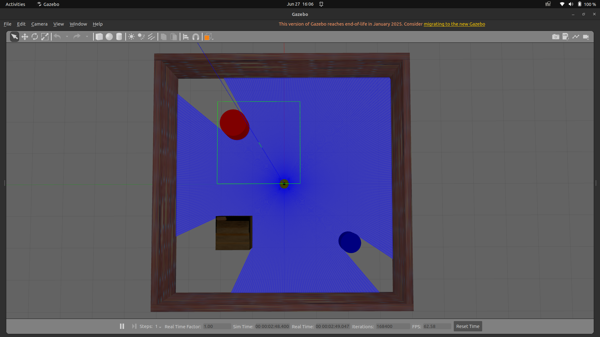
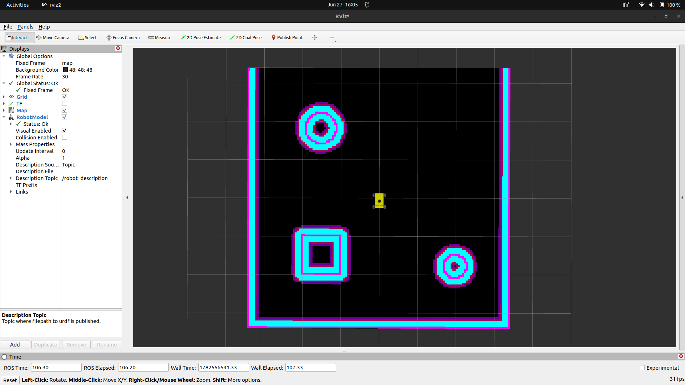

# 🤖 Mecanum Auto Sim

A complete ROS 2 Humble autonomous navigation and simulation stack for a 4WD Mecanum mobile robot. This architecture was developed by Team AutoNav for the Pragyan-2026 competition.

Currently operating at a simulation-based Technology Readiness Level (TRL), this repository serves to validate our mapping, localization, and holonomic path-planning systems before deployment to a physical prototype in real-world dynamic environments.

## 🌟 Key Features
* **Omnidirectional Navigation:** Configured using the `dwb_core::DWBLocalPlanner` in Nav2, specifically tuned with `y-velocity` parameters to allow seamless diagonal strafing and holonomic movement.
* **Custom Sensor Suite:** Replaced standard array sensors with a top-mounted 360° LiDAR, featuring aggressively tuned costmap masking (`obstacle_min_range`) and precise footprint definitions to eliminate chassis self-reflection and ghosting.
* **Precision Mapping:** Utilizes `slam_toolbox` for high-fidelity 2D occupancy grid generation.
* **Robust Localization:** Tuned AMCL parameters for rapid recovery and precise alignment within the generated map.

---

## 🛠️ Prerequisites & Installation

Ensure you have a fully working installation of ROS 2 Humble on Ubuntu 22.04. Run the following commands to install dependencies, clone the repository, and build the workspace:

```bash
# 1. Install dependencies
sudo apt update
sudo apt install ros-humble-navigation2 ros-humble-nav2-bringup ros-humble-slam-toolbox ros-humble-gazebo-ros-pkgs

# 2. Clone the repository into your workspace
cd ~/kkr_ws/src
git clone [https://github.com/Ash-2005-code/mecanum_auto_sim.git](https://github.com/Ash-2005-code/mecanum_auto_sim.git) nexus_4wd_mecanum_description

# 3. Build the workspace
cd ~/kkr_ws
colcon build --symlink-install --packages-select nexus_4wd_mecanum_description
source install/setup.bash
```

---

## 🚀 Execution Guide

### 1. Launch the Simulation Environment
Start your Gazebo simulation world along with the robot description frames and RViz visualization interface:
```bash
ros2 launch nexus_4wd_mecanum_description simulation.launch.py
```
*(Below is the expected Gazebo environment with the top-mounted LiDAR active)*



### 2. Bring Up the Nav2 Stack
In a separate terminal, launch the Nav2 navigation stack. Make sure to pass the custom parameters file and your saved environment map:
```bash
ros2 launch nav2_bringup bringup_launch.py \
use_sim_time:=True \
map:=/home/ash/kkr_ws/src/nexus_4wd_mecanum_description/maps/custom_room_map.yaml \
params_file:=/home/ash/kkr_ws/src/nexus_4wd_mecanum_description/config/custom_nav2_params.yaml
```

### 3. Initialize and Command Navigation
1. **Initial Pose Alignment:** In RViz, select the **2D Pose Estimate** tool. Click and drag at the robot's physical location to initialize AMCL. 
2. **Autonomous Goal Dispatch:** Select the **2D Goal Pose** tool, click and drag anywhere on the map to set a target position and orientation. The robot will autonomously plan and execute a holonomic trajectory to the goal.

*(Below is the RViz visualization showing the DWB local planner executing a strafing maneuver around the masked obstacles)*



---

## ⚙️ Navigation Configuration Highlights
The local controller uses the DWB planner specifically tuned to allow non-zero velocity values along the Y-axis. The critical parameters configured within `custom_nav2_params.yaml` include:

```yaml
FollowPath:
  plugin: "dwb_core::DWBLocalPlanner"
  min_vel_x: -0.5
  max_vel_x: 0.5
  min_vel_y: -0.5  # Enables backward/left strafing
  max_vel_y: 0.5   # Enables forward/right strafing
  vx_samples: 20
  vy_samples: 20   # Generates Y-velocity trajectories
  vtheta_samples: 20
```

---

